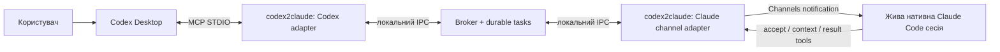

# codex2claude — технічний brief для створення проєкту

Дата підготовки: 6 жовтня 2026 року.

## 1. Завдання й зафіксовані рішення користувача

Створити власний відкритий проєкт `codex2claude`: плагін і локальний міст, з якими користувач працює в **Codex Desktop**, а архітектурні задачі та рев’ю виконує **справжня сесія Claude Code**.

Ролі:
- Codex Desktop — основний інтерфейс, координатор і виконавець змін; користувач хоче зберегти його браузерні та інші десктопні інструменти.
- Claude Code — архітектор і рев’ювер. Він сам читає наданий контекст і повертає власний результат у своїй нативній сесії.
- Наш код — доставка задач, стан, контекст, отримання результатів і інтеграція через підтримувані розширення.

Користувач має підписку Claude, але **не має Anthropic API credits / API key для цього проєкту**. Виконання повинно залишатися в незміненому Claude Code, у який користувач сам увійшов звичайним способом. Не створювати власний модельний рушій, не викликати Anthropic Messages API, не пересилати або витягувати OAuth/session credentials. Не підміняти Claude Code викликом моделі через Agent SDK.

Користувач відмовився від встановлення чужого старого мосту. Сторонні рішення можна вивчати як джерело ідей, але основний продукт потрібно написати самостійно. Не переносити головний інтерфейс у Superset, Conductor або Claude Desktop.

Бажана схема — максимально нативна інтеграція через сучасні можливості продуктів. Для першого прототипу допустимо поєднати Codex Desktop з уже відкритою інтерактивною Claude Code CLI-сесією. **Підтримка Claude Code Channels саме в Claude Desktop не підтверджена.** Не рекламувати її як готову.

Мова пояснень і робочої документації — українська. Проєкт є загальним мостом Codex/Claude, а не Oracle APEX застосунком.

## 2. Що перевірено, а що ще потрібно довести

Під час попереднього дослідження перевірено:
- npm registry повернув HTTP 404 для `codex2claude`; на момент перевірки пакет із цією точною назвою не знайдено. Це не резервування назви й не гарантія можливості публікації.
- `codex-to-claude` уже зайнятий. Обрана назва — **codex2claude**, з цифрою 2, без дефісів.
- Локальний Claude Code повідомляв версію `2.1.291`.
- Локальний Codex CLI повідомляв версію `0.160.0`.
- У локальній довідці Codex є `codex queue`, але доставку з нього саме в активний чат Codex Desktop не тестували.
- Документація Claude описує Channels; прапорці Channels не були видимі в локальній звичайній довідці. Доступність для конкретного встановлення та облікового запису ще потрібно перевірити.

Ці перевірки не доводять працездатність мосту. Не виконано реального циклу Codex Desktop → Claude Code → Codex Desktop. Не підтверджено приймання події Channels, виконання Claude, зворотний callback, підтримку Desktop Channels або оплату конкретної експериментальної сесії.

У звітах розділяти **реалізовано**, **локально перевірено**, **перевірено в реальних застосунках**, **очікує**.

## 3. Нативні можливості та первинні джерела

Перед реалізацією звірити поточні офіційні контракти; не покладатися лише на цей знімок.

### Codex

[Побудова плагінів](https://developers.openai.com/plugins/build/plugins)

Власний плагін може містити skills і MCP. Формат manifest і спосіб локального підключення потрібно взяти з актуальної документації. Під час дослідження описувалися portable Agent Plugins та сумісний Codex-формат. Не вгадувати схему JSON або копіювати випадковий manifest зі старого репозиторію. Для локального MVP не потрібен публічний hosted MCP endpoint.

[MCP у Codex](https://learn.chatgpt.com/docs/extend/mcp?surface=cli)

Для MVP потрібен локальний MCP через STDIO. Конфігурації Codex Desktop і CLI можуть використовувати спільні налаштування на одному хості; потрібно перевірити фактичне підключення в Desktop. Сам MCP надає інструменти, а не автоматично запускає іншого агента.

[Codex App Server](https://learn.chatgpt.com/docs/app-server)

App Server — можливий майбутній адаптер. Наявність протоколу не означає, що довільний окремо запущений сервер керує вже відкритим Desktop-чатом. Для будь-якого такого маршруту потрібна перевірка реальної адресації, автентифікації й підтримки поточною версією. Не використовувати приватні внутрішні сокети або сховища токенів.

### Claude Code

[Channels](https://code.claude.com/docs/en/channels) і [Channels reference](https://code.claude.com/docs/en/channels-reference)

Channels — research preview. Власний channel MCP server запускає Claude Code. Події надходять у живу інтерактивну сесію. Документоване розширення: capability `experimental["claude/channel"]`, повідомлення `notifications/claude/channel` із `content` і строковим `meta`. Повернення запису в транспорт не є підтвердженням, що Claude прийняв або виконав задачу. Наш channel має надати Claude інструменти для прийняття та відповіді.

Для власного каналу документація описує `--dangerously-load-development-channels` і нативне інтерактивне підтвердження. Це не дозвіл обходити звичайні дозволи Claude. Не замінювати цей режим `claude -p`: канал у неінтерактивному режимі не є обраним підтримуваним маршрутом.

[CLI reference](https://code.claude.com/docs/en/cli-reference), [Agent view](https://code.claude.com/docs/en/agent-view), [Desktop](https://code.claude.com/docs/en/desktop)

Сучасний Claude Code має нативні інструменти керування сесіями. Використовувати лише документовані команди й повторно звіряти локальну довідку. Відкриття Desktop або виявлення сесії не доводить можливості надіслати в неї задачу. Не робити `--bg --resume` універсальним способом повідомити вже активну сесію: можливе створення окремої копії.

[Legal and compliance](https://code.claude.com/docs/en/legal-and-compliance)

Архітектура повинна зберігати використання незміненого Claude Code, нативний вхід і власну підписку користувача. Не пропонувати Claude.ai login усередині нашого продукту, не проксіювати credentials і не робити API-білінг прихованим fallback. Це не сертифікація політик і не обіцянка необмеженого використання: перед публічними заявами повторно перевірити чинні умови.

## 4. Архітектура MVP



Потрібні **два різні MCP adapter process**. Codex і Claude запускають свої STDIO-процеси; один STDIO потік не можна просто розділити між двома хостами. Адаптери координує локальний broker через Unix socket або інший явно обмежений локальний IPC.

Broker не викликає моделі. Він зберігає задачі, адресує їх конкретному проєкту й Claude participant, доставляє події, фіксує підтвердження та результати.

Перший MVP: один користувач, один локальний хост, один проєкт, одна активна задача на Claude participant. Багато проєктів і паралельні рев’ю — наступні етапи після робочого циклу.

Не передавати Claude автоматично доступ до браузера, desktop tools або permissions Codex. Кожен агент працює з можливостями власного хоста.

## 5. Контракти нашого мосту

Назви нижче — **пропонований API codex2claude**, а не існуючі команди продуктів. Уточнити схеми перед реалізацією й документувати breaking changes.

### MCP інструменти для Codex

- `request_architecture`: мета, вимоги, обмеження, контекст проєкту; повертає task receipt.
- `request_review`: scope, точний snapshot, питання рев’ю та заявлені результати перевірок.
- `task_status`: стан, підтвердження доставки, блокер, часові межі.
- `task_result`: структурований результат завершеної задачі.
- `wait_for_task`: обмежене очікування зі зрозумілим timeout; не тримати нескінченно заблокований MCP виклик.
- `cancel_task`: фіксує запит на скасування; не обіцяє примусово зупинити вже активний native turn.

### MCP інструменти для Claude

- `accept_task`: Claude явно підтверджує task ID, participant і snapshot.
- `task_context`: читає дозволений контекст саме цієї задачі.
- `report_progress` або `report_blocked`: оновлення стану чи потреба в дії користувача.
- `submit_result`: повертає результат для того самого task ID і snapshot.

Channels-подія повинна бути коротким повідомленням про готову задачу. Великі файли й повний diff отримувати через інструмент контексту, із лімітами. Не дублювати всю історію чату в кожній події.

### Мінімальна модель даних

Task:
- версія контракту, task ID, idempotency key;
- тип `architecture` або `review`;
- project ID, канонічний root, окрема ідентичність Git worktree;
- originating Codex chat, якщо його можна отримати підтримуваним способом;
- цільовий Claude participant і bridge session;
- request, обмежений context manifest, snapshot ID;
- state, timestamps, deadline, delivery attempts;
- acceptance receipt, result receipt, cancel request;
- error або human action з людським поясненням.

Participant:
- тип хоста, project/worktree binding, capabilities;
- час останнього heartbeat, native-session binding лише з підтримуваного джерела;
- готовність channel, черга, активна задача.

Не робити UUID Codex-чату обов’язковим для першої реалізації, якщо MCP не надає його надійно. Замість вгадування застосувати явне binding до bridge session. Автоматичне повернення саме у вихідний Desktop-чат має бути окремо доведене.

Для IPC використовувати доступ тільки локального користувача: окремий приватний state directory, права на socket/store, перевірене pairing. Якщо потрібен локальний pairing secret, він не є Anthropic API key; не показувати його в логах і не комітити. Не читати credentials застосунків.

## 6. Контекст і результати ролей

### Архітектор

Отримує мету, функціональні вимоги, обмеження, наявний код і явні відкриті питання. Повертає:
1. запропоновану архітектуру;
2. альтернативи й причини вибору;
3. контракти компонентів;
4. послідовність реалізації;
5. ризики й способи перевірки;
6. уточнення, без яких рішення неможливе.

План має бути практичним і прив’язаним до цього проєкту. Claude не повинен змінювати файли під час архітектурної консультації за замовчуванням.

### Рев’ювер

Прив’язується до **конкретного вмісту**, а не лише назви гілки. Для чистого коміту зафіксувати base/head; для незакомічених змін — manifest, hashes і повний потрібний diff. Явно визначити tracked/untracked inclusion та обробку binary/large files. Якщо snapshot змінився, попереднє схвалення не поширюється на нові байти.

Повертає scope, examined/skipped files, findings із severity, file/line, evidence і пропозицією виправлення; також загальний висновок та обмеження перевірки. `no_findings` допустимо тільки для дійсно переглянутого scope. Отримання задачі й доставка повідомлення не є схваленням.

Codex може виправити findings і надіслати нове рев’ю з новим snapshot та parent task. Не створювати нескінченний автономний цикл; визначити ліміт і умови звернення до користувача.

Запуск тестів Claude має бути окремим permission рішенням: навіть тест може виконувати довільний код. Режим “review only” у prompt не є гарантією sandbox. Для сильнішої ізоляції використовувати дозволений snapshot/окрему копію та нативні обмеження доступу. Не представляти prompt як примусовий контроль прав.

## 7. Надійність і стани

Рекомендовані стани:
`queued → notified → accepted → running → completed`.

Окремо підтримати:
`needs_human`, `failed`, `expired`, `delivery_uncertain`, `cancel_requested`, `cancelled`.

Не ототожнювати:
- запис у durable queue;
- запис повідомлення в транспорт;
- явне прийняття Claude;
- завершення задачі;
- повернення результату в Codex;
- позитивний висновок рев’ю.

Збереження задачі повинно бути атомарним. Повтор запиту з тим самим idempotency key повертає попередню задачу. Повторне прийняття або результат із тим самим ID не запускає виконання ще раз; конфліктні payloads відхиляються.

Після crash/reconnect спочатку звірити стан. Для невизначеної доставки не надсилати задачу автоматично в нову сесію. Якщо retry допустимий до acceptance, він має використовувати той самий task ID, бути обмеженим і захищеним від повторного виконання participant.

Якщо Claude зайнятий або channel не готовий, показати чесний стан. Порожній heartbeat не доводить здатності Claude прийняти задачу; readiness перевіряється реальним handshake.

Скасування — cooperative: `cancel_requested` не дорівнює `cancelled`. Пізній результат після timeout/cancel зберегти як такий, не видавати за своєчасне успішне завершення. Доставлені job notifications не повинні утворювати self-triggering діалог між агентами.

## 8. Permissions і підписка

Для MVP:
- Claude запускається у власному інтерактивному середовищі, користувач сам проходить нативний login.
- Development channel вмикається через документований preview workflow із нативним підтвердженням.
- Наш плагін не виконує Anthropic API requests.
- Наш код не збирає, не копіює й не зберігає Claude/Codex auth tokens.
- Немає автоматичного permission relay і схвалення дій Claude від імені користувача.
- Немає `--dangerously-skip-permissions` або глобального вимкнення захисту.
- Не застосовувати `claude --bare` як subscription wrapper: у дослідженій версії цей режим пропускає нативну OAuth/keychain auth.
- Логи не містять credentials, повних приватних transcript або необмеженого source code.
- Рев’ю й архітектура не дають автоматичний дозвіл на commit, push, merge, npm publish або зміни чужих репозиторіїв.

Не обіцяти відсутність лімітів підписки або безумовну доступність preview. Якщо native capability відсутня, зупинити залежну частину й повідомити точну причину. Не “виправляти” проблему переходом на API-білінг або перехопленням session credentials.

## 9. Пропонована організація коду

Обрати простий Node.js/TypeScript стек, якщо перевірені versions/engines і офіційний MCP SDK сумісні. Не встановлювати сторонній multi-agent framework без конкретної потреби. Закріпити перевірені dependency versions.

Орієнтовна структура:
```text
src/
  broker/
  storage/
  protocol/
  adapters/codex-mcp/
  adapters/claude-channel/
  cli/
plugin/
  [manifest за чинним офіційним форматом]
  skills/architecture/
  skills/review/
docs/
  architecture.md
  setup.md
  subscription-boundary.md
  verification.md
tests/
  unit/
  integration/
package.json
README.md
CODEX_HANDOFF.md
```

CLI може мати власні команди `doctor`, `broker`, `mcp codex`, `mcp claude`. Це пропозиція, не чинні команди встановленого пакета.

`doctor` перевіряє versions, transport, доступність bridge, конфігурацію без секретів і результати native handshake. Не виводить auth files. Не оголошує “готово” лише тому, що binary знайдено.

Skills Codex мають пояснювати, коли залучати архітектора/рев’ювера, як сформувати scope, дочекатися відповіді та використати findings. Інструкції не повинні заявляти неперевірену підтримку Claude Desktop.

## 10. План реалізації з контрольними точками

### Етап 0 — огляд репозиторію й capability gate

Прочитати чинні AGENTS.md та інші repo instructions. Перевірити root, Git стан, branch/remote й наявні файли; не перезаписати чужі зміни. Репозиторій новий, але не припускати, що він порожній.

Звірити офіційні docs, установлені версії, native help, plugin manifest і доступність Channels. Підготувати короткий decision record із “підтверджено / потребує live перевірки”. Не будувати великий broker до перевірки ключової інтеграції.

### Етап 1 — мінімальний справжній spike

Реалізувати маленький Codex MCP adapter, channel adapter і мінімальний локальний обмін. Підготувати конкретну інструкцію запуску для користувача й один тестовий запит без доступу до приватного коду.

У живій сесії Claude:
1. native channel завантажився;
2. Claude отримав подію;
3. Claude викликав acceptance tool;
4. Claude надав власну відповідь через result tool;
5. Codex Desktop отримав результат через MCP.

Якщо потрібне нативне підтвердження або interaction користувача, закінчити всю доступну підготовку та попросити лише необхідну дію. Не видавати mock за real run.

### Етап 2 — durable broker

Додати storage, idempotency, participant/project binding, heartbeat, bounded wait, deadlines, crash recovery та контроль повторної доставки. Для одного користувача не додавати web service або cloud auth.

### Етап 3 — ролі й snapshot review

Додати architecture/review skills, context manifests, результати зі схемою, snapshot hashing і обмежений цикл виправлень. Перевірити, що застарілий review result не застосовується до нових змін.

### Етап 4 — нативне повернення в Codex Desktop

Базовий шлях — результат через MCP status/result/wait у поточному chat workflow. Якщо задача триває довго, це ще не гарантує автоматичне пробудження чату після завершення turn.

Дослідити підтримуваний callback: наявний `codex queue` або App Server. Приймати адаптер лише після демонстрації відповіді саме у вихідному Desktop-чаті, без створення стороннього agent engine. Queue receipt не є доказом, що чат виконав новий turn.

Якщо підтримуваного callback немає, задокументувати manual resume/status як тимчасове обмеження MVP. Не називати його повністю автоматичним. Не підміняти схему clipboard/UI automation або private inbox scraping.

### Етап 5 — упаковка й документація

Зробити локально інстальований Codex plugin, npm package metadata, зрозумілий onboarding, діагностику й операторські docs. Документувати experimental support і версії, реально протестовані у Desktop/CLI.

Публічний репозиторій і вільна назва npm не є дозволом публікувати пакет. Підготувати release artifacts; publish/commit/push виконувати лише в дозволеному scope після відповідної інструкції користувача.

## 11. Перевірки

Автоматизовані перевірки мають перевіряти поведінку, а не повторювати код:
- валідність MCP/Channels schemas і reply correlation;
- idempotency запиту, acceptance і result;
- atomic persistence/restart recovery;
- відхилення іншого project/participant/snapshot;
- обмеження контексту, шляхів і розмірів;
- timeout, uncertain delivery, cooperative cancellation;
- redaction логів і відсутність читання credentials;
- повторна доставка без повторного виконання.

Mocks корисні для цих тестів, але не доводять native integration.

Live acceptance:
- користувач залишається у Codex Desktop;
- задачу архітектури приймає справжній Claude Code, повертає відповідь;
- задачу рев’ю приймає Claude Code для зафіксованого snapshot;
- Codex отримує findings, виправляє контрольний приклад і отримує результат нового review;
- немає API key/прямого модельного виклику в нашій реалізації;
- звичайні permissions Claude збережені;
- надано evidence receipts і чітко визначено, чи callback автоматичний.

Провести негативний тест із недоступною Claude-сесією, один reconnect/crash test і тест відхилення результату для зміненого snapshot. Повторювати перевірки, коли цього потребують зміни або невирішені ризики, а не для формального множення тестів.

## 12. Критерій готовності й фінальний звіт

Готовий MVP — це робочий цикл у реальних Codex Desktop і Claude Code, локальна інсталяція, дві ролі, коректний snapshot binding, надійні стани та чесні обмеження.

Якщо live перевірка заблокована обліковим записом, preview feature або необхідним нативним підтвердженням, можна завершити локальну реалізацію й тести, але інтеграція лишається **не підтверджена**.

Фінальний звіт:
- що реалізовано й де лежить код;
- які локальні перевірки пройшли;
- що підтверджено в реальних застосунках;
- що очікує і яка конкретна дія потрібна;
- точна інструкція локального запуску;
- чи повертається результат автоматично саме в початковий Desktop-чат.

Не завершувати роботу лише на загальному плані. Почати із capability gate, довести мінімальний міст і розширювати його до практичного MVP без порушення вимоги про нативну Claude Code сесію та підписку.
