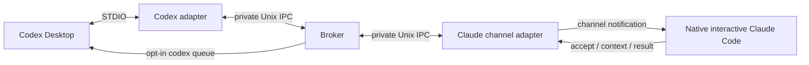

# Архітектура codex2claude

Broker не викликає модель. Codex та Claude Code запускають різні STDIO MCP adapter processes; між ними — приватний Unix socket і durable JSON store. У MVP один host, один project/worktree binding, один participant `claude-local`, одна незавершена задача.

`init` фіксує canonical root, Git common-dir identity, worktree identity, bridge session та pairing для двох ролей. Native Claude session UUID не вгадується: lease прив'язаний до процесу channel adapter. Originating Codex chat — необов'язкове явне metadata. При `notify_on_completion:true` воно має точно збігтись із UUID явно увімкненого callback route; маршрут і absolute Codex binary фіксуються в задачі на момент request.

State directory `.codex2claude` має 0700; config/store 0600. Socket — 0600 у стабільному per-user каталозі `/private/tmp/c2c-UID-WORKTREEHASH`, незалежно від TMPDIR. Broker перевіряє роль, pairing і binding кожного запиту. Цей захист ізолює інших локальних користувачів; він не ізолює зловмисний процес того самого користувача, який може читати state directory. Pairing secret є локальним секретом мосту, не auth token застосунку.

`tasks.json` записується через exclusive temp → fsync → rename → directory fsync. Broker є єдиним writer; lock забороняє другий процес. Записи містять bounded request, immutable current/base UTF-8 bytes, hashes, deadline, receipts та events. stdout adapter — тільки MCP, stderr — codes без request/source content. Raw tool errors і transcript не логуються.

Canonical hashes сортують ключі ordinal UTF-16, без залежності від process locale. Перед заміною comparator перевірено 13 binding/request/snapshot/result digests чотирьох наявних native tasks: усі збігаються, історичні receipts збережені. Integrity checks виявляють випадкове пошкодження; same-user процес може перезаписати дані й hashes, це не tamper-proof storage.

## Readiness та доставка

Adapter heartbeat доводить тільки наявність adapter. Broker надсилає одноразовий випадковий nonce як Channels event. Claude має викликати `channel_ready` з цим nonce; тільки тоді broker пропонує задачі.

Durable task: `queued`. До notification broker атомарно ставить `delivery_uncertain`, після transport write — `notified`. Це ще не Claude acceptance. `accept_task` фіксує task/snapshot/lease і повертає `execute=true` лише вперше; повтор — `execute=false`. Result приймається тільки для цього accepted binding. Конфліктний повтор відхиляється.

Crash після підготовки доставки залишає uncertainty. Після restart немає automatic replay: `notified` стає `delivery_uncertain`; accepted/running — `needs_human`. Новий adapter lease не успадковує acceptance. `reconcile_delivery` дозволяє явний retry тієї самої unaccepted задачі максимум тричі або cancel. Accepted execution після втрати native session у MVP потребує перевірки людиною; автоматичного rebind немає.

Після 10 секунд без heartbeat ці самі uncertainty states фіксуються без рестарту broker. Progress зберігається окремо. Людина після зупинки native session може виконати CLI `resolve-stopped` із точним accepted lease і підтвердженням: задача стає `failed`, зберігає operator receipt та звільняє слот. Connected adapter не допускає цього переходу. Це attestation людини, не примусове завершення процесу. Дія виключена з MCP tool catalog, але trusted same-user shell/IPC процеси можуть її викликати; окремої operator authentication немає.

Deadline → `expired`, але не доводить зупинки accepted turn. Slot утримується до result, підтвердженого cancel або operator stopped receipt. Скасування active/delivered task → `cancel_requested`; окрема подія просить Claude припинити роботу. `acknowledge_cancel` → `cancelled`, повтор idempotent. Pending cancellation повторюється після broker restart; це не повтор задачі. Native turn не вбивається. Result після deadline/cancel/operator failure зберігається з `late=true` без своєчасного completed. `wait_for_task` обмежений 25 секундами.

Пізній cancel acknowledgment після operator failure залишає `failed`. `task_result`/`wait_for_task` видають несвоєчасний payload у `late_result`, а `result` заповнюють лише для своєчасного `completed`.

## Snapshot review

`files` — обов'язковий явний scope review. Capture підтримує tracked/untracked/deleted text files; source head — саме поточні worktree bytes, base — resolved Git commit (HEAD за замовчуванням). Full current/base content зберігається, тому Claude має весь потрібний diff без повторного читання mutable файлів. Clean-commit mode з окремим immutable head ref ще не реалізований.

Ліміти: 100 файлів, 128 KiB/file (current і base), 1 MiB сумарно; context pages до 16000 символів. Symlink components, binary/invalid UTF-8, traversal, абсолютні paths та відомі auth/secret paths відхиляються. Allowlist шляхів не гарантує відсутності секретів у звичайному source file: оператор сам обирає, що надсилати Claude.

Paginated `content` містить лише immutable request/snapshot/binding. Поточні `state`/`cancel_request` повертаються окремими полями, тому cancellation не зміщує offsets у JSON, який Claude збирає зі сторінок.

Review result має examined/skipped coverage усього manifest. `no_findings` вимагає повного examined scope без findings/skips. Перед використанням Codex викликає `check_snapshot`; зміна hashes чи Git head скасовує applicability старого висновку. Findings не є гарантією correctness; limitations і фактичні тести залишаються окремими. Parent chain обмежений трьома задачами.

## Desktop callback

Результат доступний через MCP `wait_for_task`, `task_status`, `task_result`. Opt-in callback застосовує підтримуваний CLI `codex queue --thread UUID --message TEXT` із literal argv, без shell/config/auth overrides. Standalone probe на CLI 0.160.0 фактично надійшов у той самий Desktop чат і запустив новий turn. App Server/private sockets/clipboard не використовуються як fallback.

Route конфігурується CLI-only й зберігається у private bound store. Request має окремо вказати `notify_on_completion:true` та matching `originating_chat`. Callback створюється тільки після своєчасного `completed`, без raw source, goal чи Claude payload у повідомленні. Envelope містить project/binding, bridge session, task/snapshot/result digest і random nonce; не дає нових permissions. Nonce генерується при dispatch і передається тільки у повідомленні; store містить SHA-256 від canonical nonce, а RPC/MCP receipts виключають і nonce, і його digest. Legacy alpha plaintext receipt мігрується в hash без повтору доставки та позначається legacyNonceExposed. Для вже sent exposed receipt ack відхиляється: потрібен manual resume, він не є delivery proof. Pending legacy отримує свіжий nonce при першому dispatch.

Доставка: `pending` → durable `sending` **до** spawn → `queued` лише після exact addressed CLI receipt. Фактичне отримання в чаті підтверджується `acknowledge_callback` із усіма matching fields → `delivered`. Ack під час `sending` або `uncertain` допустимий, якщо повідомлення справді надійшло; пізній CLI receipt не повертає state з delivered до queued. CLI має 15-second timeout і 16-KiB output limit; stderr/auth metadata не зберігаються. Помилка persistence до sender повертає rejected promise, не запускає CLI й повертає in-memory pending для безпечного повтору лише запису. Crash у sending, помилка CLI або нерозпізнаний output → `uncertain`, без auto retry. Queued callbacks також не повторюються після restart. Shutdown дочікується bounded flight, навіть якщо final persistence відхилено, та прибирає socket/lock; CLI signal handler має sanitized error exit.

Disable/інший route suppresses ще не відправлений callback, якщо старий маршрут уже не enabled на момент dispatch. Зміна тільки codexBin теж suppresses старі pending callbacks, бо route digest охоплює binary path. `suppressed` не поновлюється автоматично. Disable відхиляється під час sending; уже queued повідомлення не відкликається. Failure/expired/cancel/late result не мають автоматичної notification у цьому MVP; manual resume/status лишається fallback, так само для uncertain callback. Callback retry команду не реалізовано.

Ack та CLI config доступні trusted same-user процесам: nonce/correlation виявляють помилки маршруту, але не автентифікують Desktop UI. Звичайні MCP receipts не дають готового ack; same-user процес поза цим інтерфейсом усе ще може спостерігати argv або редагувати store. Політика агента вимагає ack лише після actual incoming message. Читання store/queue receipt цього не замінює. Фактичний task-completion end-to-end proof відокремлено у verification.
