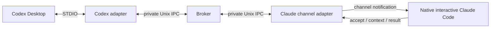

# Архітектура codex2claude

Broker не викликає модель. Codex та Claude Code запускають різні STDIO MCP adapter processes; між ними — приватний Unix socket і durable JSON store. У MVP один host, один project/worktree binding, один participant `claude-local`, одна незавершена задача.

`init` фіксує canonical root, Git common-dir identity, worktree identity, bridge session та pairing для двох ролей. Native Claude session UUID не вгадується: lease прив'язаний до процесу channel adapter. Originating Codex chat — необов'язкове явне metadata, не адреса callback.

State directory `.codex2claude` має 0700; config/store 0600. Socket — 0600 у стабільному per-user каталозі `/private/tmp/c2c-UID-WORKTREEHASH`, незалежно від TMPDIR. Broker перевіряє роль, pairing і binding кожного запиту. Цей захист ізолює інших локальних користувачів; він не ізолює зловмисний процес того самого користувача, який може читати state directory. Pairing secret є локальним секретом мосту, не auth token застосунку.

`tasks.json` записується через exclusive temp → fsync → rename → directory fsync. Broker є єдиним writer; lock забороняє другий процес. Записи містять bounded request, immutable current/base UTF-8 bytes, hashes, deadline, receipts та events. stdout adapter — тільки MCP, stderr — codes без request/source content. Raw tool errors і transcript не логуються.

## Readiness та доставка

Adapter heartbeat доводить тільки наявність adapter. Broker надсилає одноразовий випадковий nonce як Channels event. Claude має викликати `channel_ready` з цим nonce; тільки тоді broker пропонує задачі.

Durable task: `queued`. До notification broker атомарно ставить `delivery_uncertain`, після transport write — `notified`. Це ще не Claude acceptance. `accept_task` фіксує task/snapshot/lease і повертає `execute=true` лише вперше; повтор — `execute=false`. Result приймається тільки для цього accepted binding. Конфліктний повтор відхиляється.

Crash після підготовки доставки залишає uncertainty. Після restart немає automatic replay: `notified` стає `delivery_uncertain`; accepted/running — `needs_human`. Новий adapter lease не успадковує acceptance. `reconcile_delivery` дозволяє явний retry тієї самої unaccepted задачі максимум тричі або cancel. Accepted execution після втрати native session у MVP потребує перевірки людиною; автоматичного rebind немає.

Deadline → `expired`, але не доводить зупинки accepted turn. Slot утримується до result або підтвердженого cancel. Скасування active/delivered task → `cancel_requested`; окрема подія просить Claude припинити роботу. `acknowledge_cancel` → `cancelled`. Native turn не вбивається. Result після deadline/cancel зберігається з `late=true` без своєчасного completed. `wait_for_task` обмежений 25 секундами.

## Snapshot review

`files` — обов'язковий явний scope review. Capture підтримує tracked/untracked/deleted text files; source head — саме поточні worktree bytes, base — resolved Git commit (HEAD за замовчуванням). Full current/base content зберігається, тому Claude має весь потрібний diff без повторного читання mutable файлів. Clean-commit mode з окремим immutable head ref ще не реалізований.

Ліміти: 100 файлів, 128 KiB/file (current і base), 1 MiB сумарно; context pages до 16000 символів. Symlink components, binary/invalid UTF-8, traversal, абсолютні paths та відомі auth/secret paths відхиляються. Allowlist шляхів не гарантує відсутності секретів у звичайному source file: оператор сам обирає, що надсилати Claude.

Review result має examined/skipped coverage усього manifest. `no_findings` вимагає повного examined scope без findings/skips. Перед використанням Codex викликає `check_snapshot`; зміна hashes чи Git head скасовує applicability старого висновку. Findings не є гарантією correctness; limitations і фактичні тести залишаються окремими. Parent chain обмежений трьома задачами.

## Desktop callback

Результат доступний через MCP `wait_for_task`, `task_status`, `task_result` у поточному workflow. Автоматичне пробудження вихідного Desktop chat після закінчення turn не реалізоване. Наявність `codex queue` 0.160.0 підтверджена, але адресація саме живого Desktop chat не перевірена. App Server/private sockets/clipboard не використовуються як прихований fallback.
